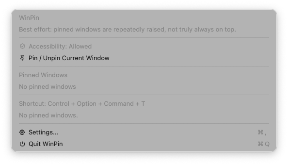
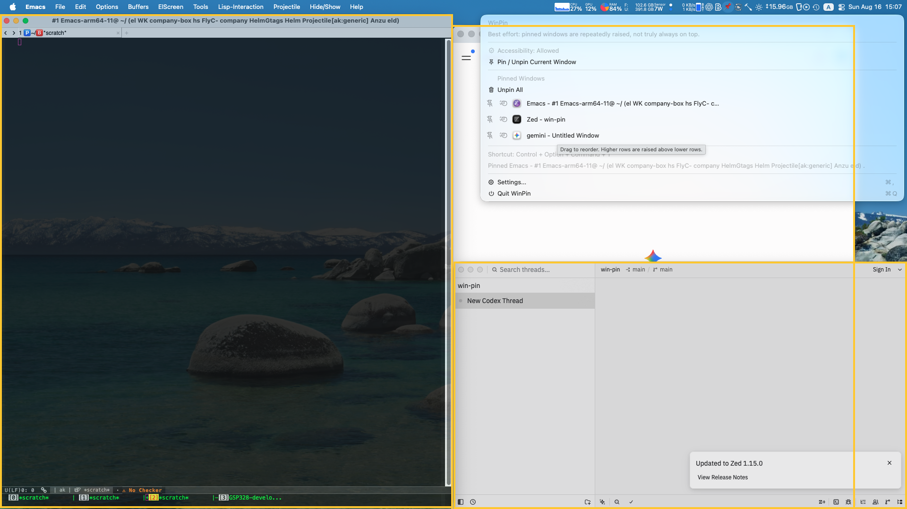

This doc is for `WinPin` version 0.0.5 (stable version)

# About

WinPin is a native macOS AppKit menu bar app for best-effort per-window pinning.

Useful when;

- You are annoyed by the default MacOS switcher, which brings all windows in front.
  This behavior hides the previous window you were working but you have been interested in yet.
  - You want to focus solely on the active windows you're using across multiple apps.
- You join a video meeting while keeping the window on top of other screens.
  (e.g. Zoom.app supports this feature, but only when minimized).

## Installation

### Homebrew (Recommended)

```sh
brew tap aki-s/tap
brew install --cask win-pin
```

## Features

### Shortcut

`ctrl+alt+Command+t` to Pin the currently focused window.

### Menu bar



You can define which window should be stacked on the other Pinned windows manually.



## Development

### Daily Development & Debugging

```sh
# Build debug binary and reset accessibility permission
./scripts/build-debug-reset-accessibility.sh

# Restart app
make restart
# or ./scripts/restart.sh
```

### Test & Lint

```sh
# Run unit tests
make test

# Run static analysis and lint
make lint

# Automatically format and fix lint issues
make fix
```

### Release Workflow (way1 / from GitHubAction)

1. Issue tag
2. Run action `release.yml`

### Release Workflow (way2 / from localhost)

#### 1. Install CLIs

```sh
brew install goreleaser act gh
```

#### 1. Register PAT for ${owner}/homebrew-tap

Register PAT secret named `HOMEBREW_TAP_GITHUB_TOKEN` to access ${owner}/homebrew-tap at the artifact repository

https://github.com/${owner}/WinPin/settings/secrets/actions

#### 2. Tag version, then release

```sh
APP_VERSION=1.0.0 # assume version is 1.0.0
export HOMEBREW_TAP_GITHUB_TOKEN="github_pat_...."
git tag ${APP_VERSION}; git push -u origin ${APP_VERSION};  TAG=${APP_VERSION}  ./scripts/localhost-act-release.sh
```

#### 3. Check PR created to ${owner}/homebrew-tap

https://github.com/${owner}/homebrew-tap/pull/
